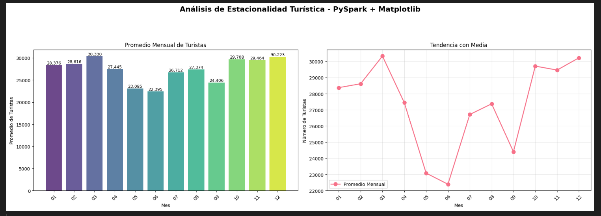
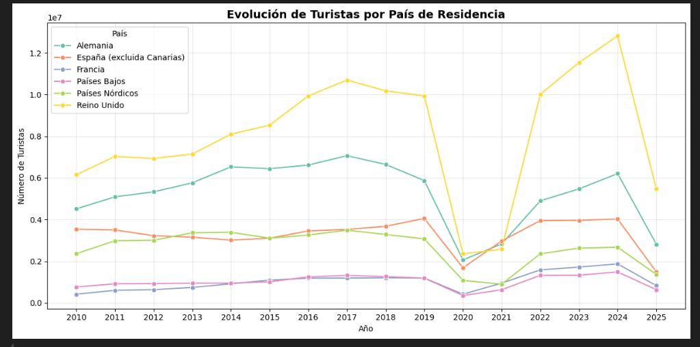

# 🏨 Análisis del Turismo en Canarias: Datos para la Toma de Decisiones Estratégicas

## 📌 Objetivo del Proyecto

Este análisis tiene como propósito brindar respuestas a preguntas clave que cualquier empresario del sector turístico en Canarias podría hacerse:

- ¿Cuáles son los mejores meses para reforzar estrategias de *Revenue Management*?  
- ¿Qué mercados están ganando protagonismo tras la pandemia?  
- ¿Qué islas concentran la mayor parte del turismo y cómo está evolucionando esa distribución?

---

## 📊 Tecnologías Utilizadas

- **Lenguaje:** Python  
- **Procesamiento de datos:** PySpark  
- **Entorno de trabajo:** Jupyter Notebook  
- **Visualización:** Seaborn, Matplotlib, Pandas  
- **Fuente de datos:** API de ISTAC (Instituto Canario de Estadística)

---

## 🔍 Hallazgos Clave

### 🗓️ Estacionalidad del Turismo

- Tras **abril**, se detecta una baja de afluencia que se mantiene hasta julio.  
  → Oportunidad para campañas promocionales en temporada media-baja.  
- **Septiembre** también presenta una caída leve.  
  → Ideal para estrategias de fidelización o *last-minute deals*.  
- Meses con mayor demanda turística: **marzo** y **diciembre**.  
  → Aplicar precios dinámicos para maximizar ingresos.

  

### 🌍 Principales Mercados

- **Alemania** y **Reino Unido** son los principales emisores de turistas.  
- Tras el **COVID-19**, Reino Unido se recupera con fuerza y supera a Alemania en más de **3 puntos de cuota de mercado**.  
  → Redirigir esfuerzos de marketing al público británico.

    

### 🏝️ Distribución del Turismo por Isla

- **Tenerife**: 38.1% del total de turistas.  
- **Gran Canaria**: 26.66%.  
- **Lanzarote**: 18.62%.  
- En **2022**, Lanzarote mostró un gran crecimiento que luego se estabilizó.  
  → Detectar nuevas oportunidades o reforzar posicionamiento.

---

## 🧠 Implicaciones Estratégicas para el Sector Hotelero

Este análisis puede ser usado por hoteles, agencias y gestores turísticos para:

- 📈 Optimizar campañas de marketing según el mes y la isla.  
- 🧭 Diseñar estrategias diferenciadas por mercado emisor (Alemania vs. Reino Unido).  
- 💰 Ajustar precios y paquetes turísticos con base en la estacionalidad detectada.  
- 🔎 Detectar oportunidades de crecimiento en islas con variaciones recientes como Lanzarote.

---

## 📎 Conclusión

Este trabajo ofrece una visión **accionable** del comportamiento turístico en Canarias a partir de datos abiertos y herramientas de análisis modernas. Su aplicación práctica puede mejorar significativamente la **planificación**, **captación** y **retención de clientes** en el sector.

---
